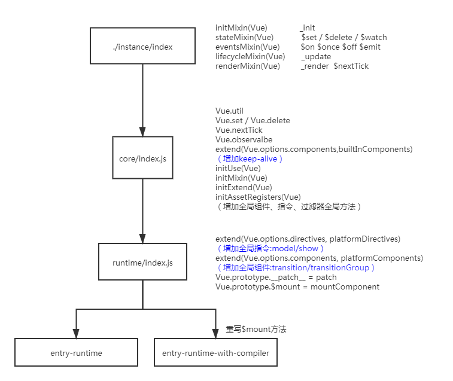

- 下载好 vue-dev 源码后，运行 `cnpm i` 安装好依赖
- 千万不要使用 `npm i` 安装，各种报错（血泪的教训）

- 代码的目录结构
- .circleci 持续集成
- .github 钩子
- benchmarks 性能测试
- dist 打包结果
- examples 官方示例
- flow Facebook 出品，用于类型声明（与 TypeScript 功能类似），没人用了
- packages 一些写好的包：服务端渲染 编译器 weex相关的包
- scripts 打包的脚本
- src 源代码
    - compiler 用作模板编译的
    - core 核心代码
    - platforms 平台
    - server 服务端渲染相关的代码
    - sfc 解析单文件组件的相关代码，结合 vue-loader 使用
    - shared 模块之间的共享属性和方法
- test 测试
- types 类型声明文件

- 通过 package.json 找到打包入口 scripts/config.js
- 指定了 TARGET web-full-dev 打包目标 resolve('web/entry-runtime-with-compiler.js')
- 最终打包入口指向 src/platforms/web/entry-runtime-with-compiler.js
- entry-runtime-with-compiler.js 与 entry-runtime.js 的区别在于前者重写了 mount 方法，其中增加了将 template 转化为 render 函数的步骤
- src/platforms/web/runtime 运行时相关的代码，提供一些 dom 操作 api、属性操作、元素操作、一些组件和指令

